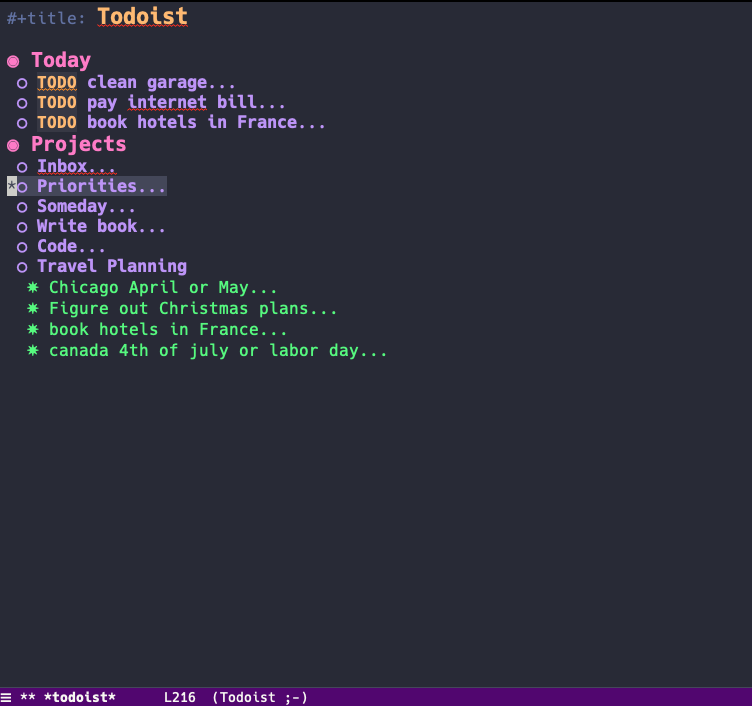

[](https://melpa.org/#/todoist)

# emacs-todoist
Emacs interface to [Todoist](https://todoist.com)



## Installation
1. Get it from Melpa, or load the `todoist.el` file
2. Get your Todoist personal API token [here](https://todoist.com/Users/viewPrefs?page=integrations)
3. Load it up via

   a. Elisp
       ```
       (setq todoist-token "XXXXXXXXXXXXXXXXXXXX")
       ```

   b. Environment variable as `TODOIST_TOKEN`

4. Call `M-x todoist` to pull up your tasks.

## Usage

`M-x todoist` is the main command to pull up your tasks.

In the todoist buffer, you can use
```
C-x t => open up task menu
C-x p => open up project menu
```
these menus will respectively allow you to:
- create/update/delete/close tasks
- create/update/delete projects

*Please note that the usual `C-c C-t` org-mode task shortcut will not close the task for todoist. It might be a useful feature in the future.*

### Customization

- `todoist-backing-buffer`
  Set it to a file path and the todoist task list will be saved on disk at that location, making it easy to add todoist tasks to a custom agenda view.

- `todoist-show-all`
  If true, show all tasks un-collpased. Default is nil for default view.

## Disclaimer
This extension is not created by, affiliated with, or supported by Doist.

## Issues & Features
If there is a missing feature that you would like implemented, or if you find a bug, feel free to open up an issue, or even better, a pull request.
